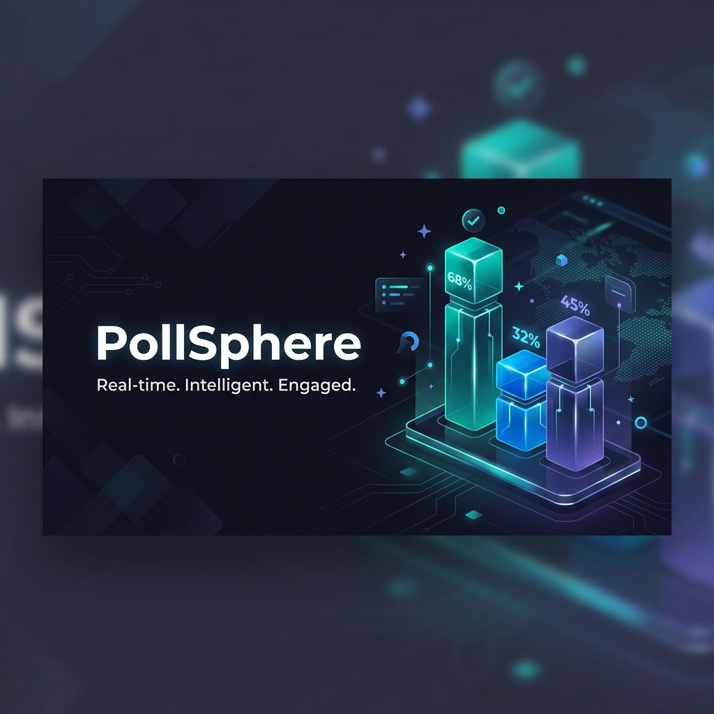

# <p align="center">📊 PollSphere</p>

<p align="center">
  <strong>A production-ready, full-stack real-time polling platform.</strong>
</p>

<p align="center">
  
</p>

<p align="center">
  <a href="#-features">Features</a> •
  <a href="#-tech-stack">Tech Stack</a> •
  <a href="#-getting-started">Getting Started</a> •
  <a href="#-docker">Docker</a> •
  <a href="#-architecture">Architecture</a>
</p>

---

## 🌟 Overview

**PollSphere** is a high-performance, real-time feedback and polling platform designed for modern web engagement. Whether you need quick feedback from a community or a structured vote for a decision, PollSphere provides the tools to create, manage, and visualize data in real-time.

Built with a focus on **speed, security, and scalability**, it leverages the power of WebSockets for live updates and robust authentication via Clerk to ensure data integrity.

---

## 🚀 Key Features

- ⚡ **Real-time Synchronization:** Live voting progress updates via `Socket.IO` with zero latency and no page refreshes.
- 🔒 **Secure Authentication:** Integrated with `Clerk` for seamless user management and social logins.
- 🕒 **Microsecond Precision:** Strict poll expiry enforcement ensures votes are only counted within the designated window.
- 🗳️ **Flexible Voting Modes:** Support for both authenticated (1 vote per user) and anonymous (IP-based tracking) voting.
- 📊 **Dynamic Data Visualization:** High-quality charts and progress bars built with `Recharts` and `Framer Motion`.
- 🛡️ **Type Safety & Validation:** End-to-end type safety using TypeScript and runtime schema validation with `Zod`.
- 📱 **Fully Responsive:** A premium dark-mode UI that works beautifully on desktops, tablets, and mobile devices.

---

## 🛠️ Tech Stack

| Frontend | Backend | DevOps & Infrastructure |
| :--- | :--- | :--- |
| **React 19** (Vite) | **Node.js & Express** | **Docker & Docker Compose** |
| **Tailwind CSS 4** | **TypeScript** | **Redis** (Socket.IO Adapter) |
| **TanStack Router** | **MongoDB (Mongoose)** | **Netlify** (Frontend Hosting) |
| **Framer Motion** | **Socket.IO** | **GitHub Actions** (CI/CD) |
| **Clerk Auth** | **Clerk SDK** | **Zod** (Validation) |
| **Recharts** | **Helmet & Morgan** | **Express Rate Limit** |

---

## 🚦 Getting Started

### Prerequisites

- **Node.js** (v20 or higher)
- **Docker & Docker Compose** (optional, for containerized setup)
- **MongoDB Instance** (Local or Atlas)
- **Clerk Account** (For Auth keys)

### 1. Clone and Install

```bash
git clone https://github.com/h-anand21/hackathon.git
cd hackathon/PollSphere

# Install dependencies for both services
cd backend && npm install
cd ../frontend && npm install
```

### 2. Environment Configuration

Create `.env` files in both `backend` and `frontend` directories.

**Backend (`backend/.env`):**
```env
PORT=5000
MONGODB_URI=your_mongodb_connection_string
CLERK_SECRET_KEY=your_clerk_secret_key
REDIS_URL=redis://localhost:6379 (optional)
```

**Frontend (`frontend/.env`):**
```env
VITE_API_URL=http://localhost:5000/api
VITE_CLERK_PUBLISHABLE_KEY=your_clerk_pub_key
```

### 3. Local Development

Start the backend (from `backend` folder):
```bash
npm run dev
```

Start the frontend (from `frontend` folder):
```bash
npm run dev
```

---

## 🐳 Running with Docker

PollSphere is fully containerized for easy deployment. To spin up the entire stack including the database and Redis:

```bash
docker-compose up --build
```

- **Frontend:** `http://localhost:5173`
- **Backend API:** `http://localhost:5000`

---

## 🧠 Database & Architecture

PollSphere uses a highly optimized MongoDB schema designed for atomic operations and consistency.

- **User Model:** Lightweight sync with Clerk for profile persistence.
- **Poll Model:** Efficiently indexed by `expiresAt` for rapid cleanup and access.
- **Aggregation Pipelines:** Complex result calculations are offloaded to MongoDB for performance.
- **Compound Indexes:** Guaranteed "Single Vote" integrity at the database level.

### System Flow
1. **Creator** defines poll and constraints.
2. **Voters** interact via real-time WebSocket connection.
3. **Backend** validates votes using Zod schemas and IP/User tracking.
4. **Socket.IO** broadcasts updates to all active participants instantly.

---

## 📄 License

This project is licensed under the MIT License - see the [LICENSE](LICENSE) file for details.

---

<p align="center">
  Built with ❤️ for the Hackathon by <a href="https://github.com/h-anand21">H-Anand21</a>
</p>

